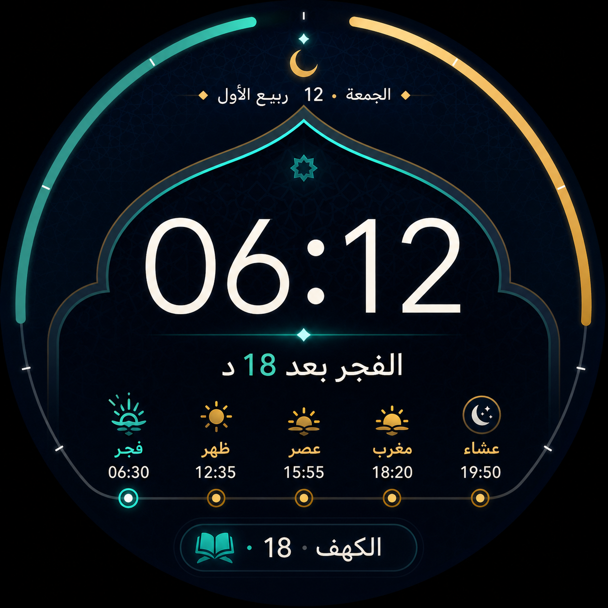
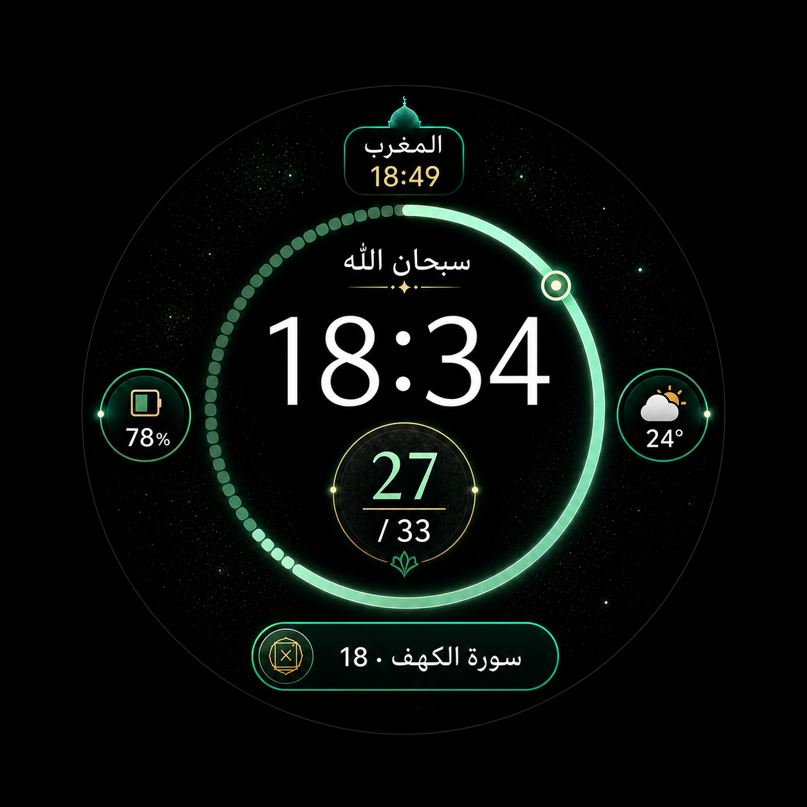
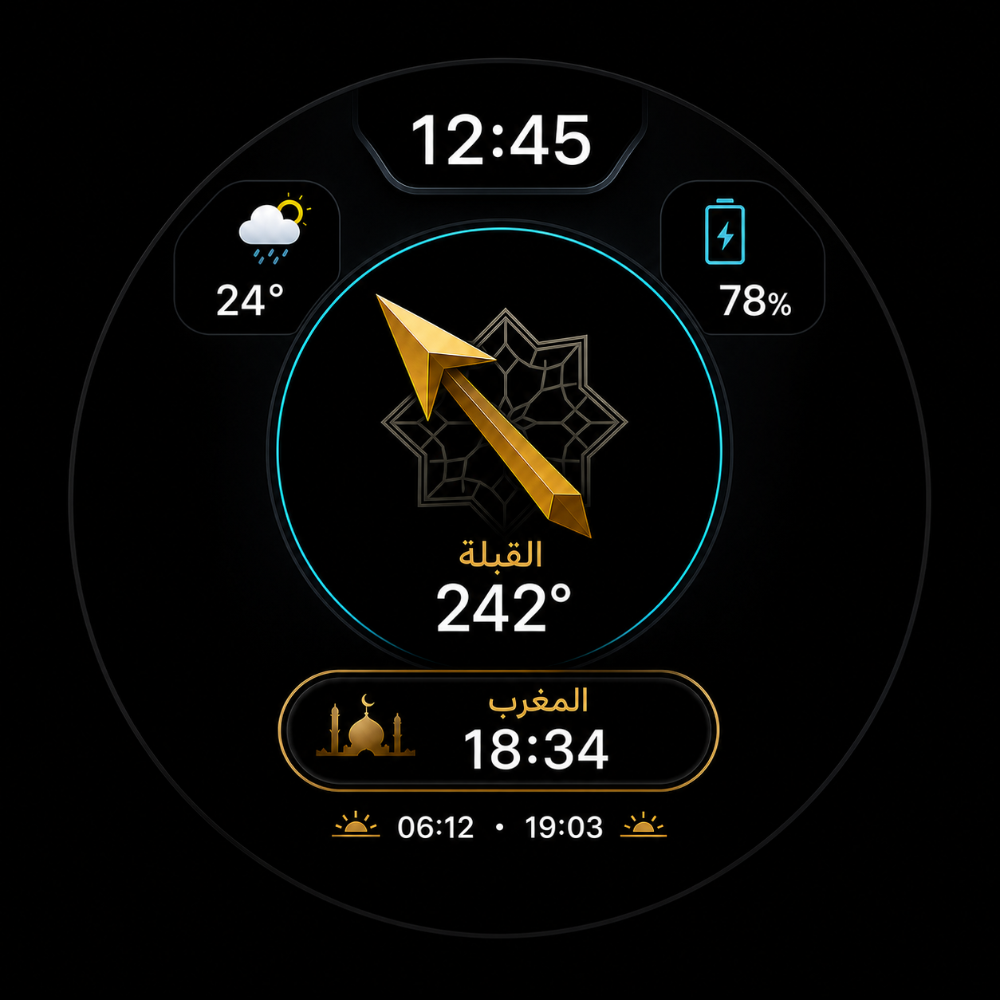
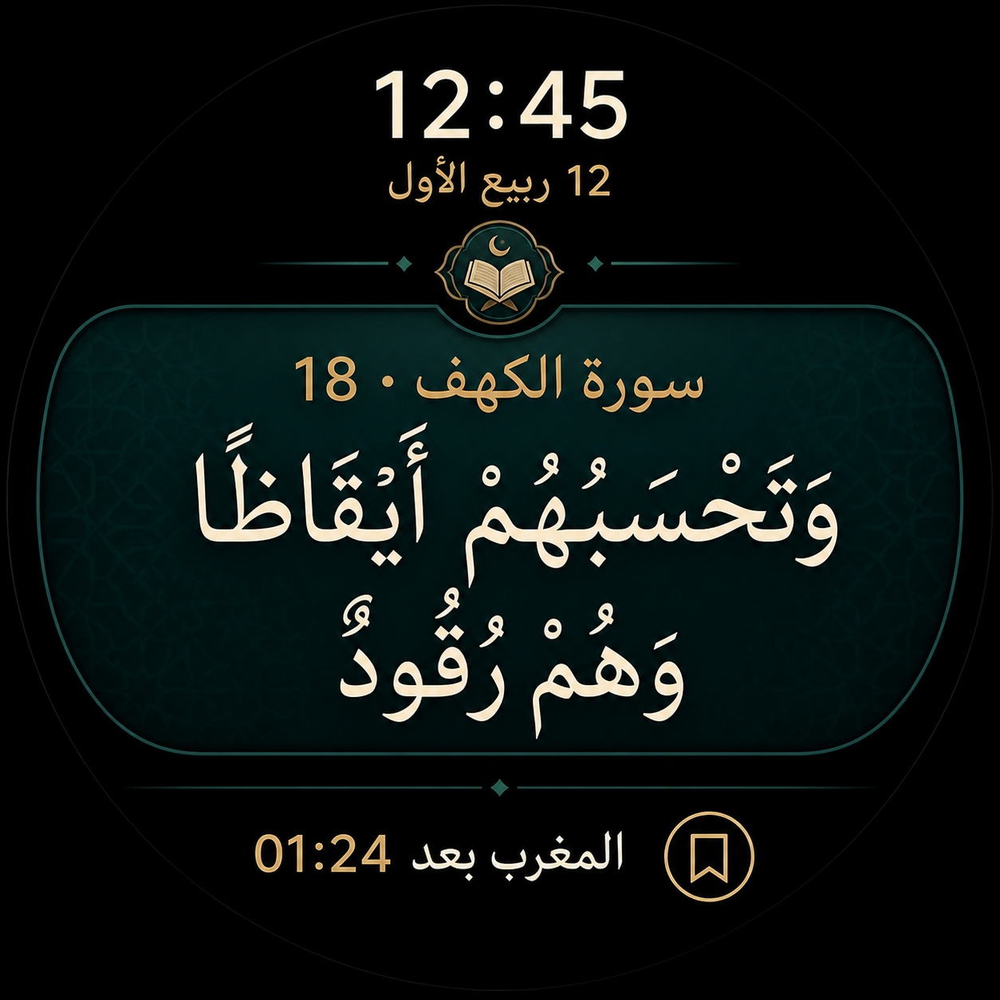
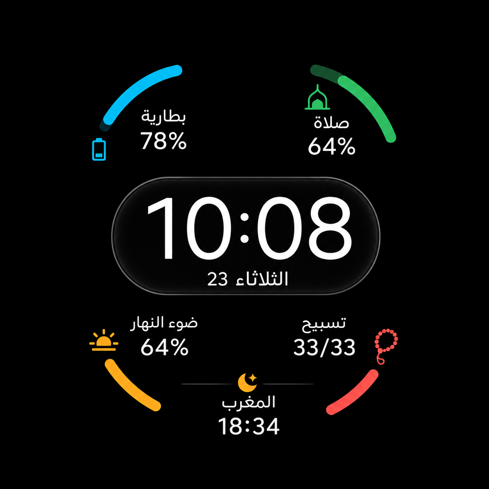
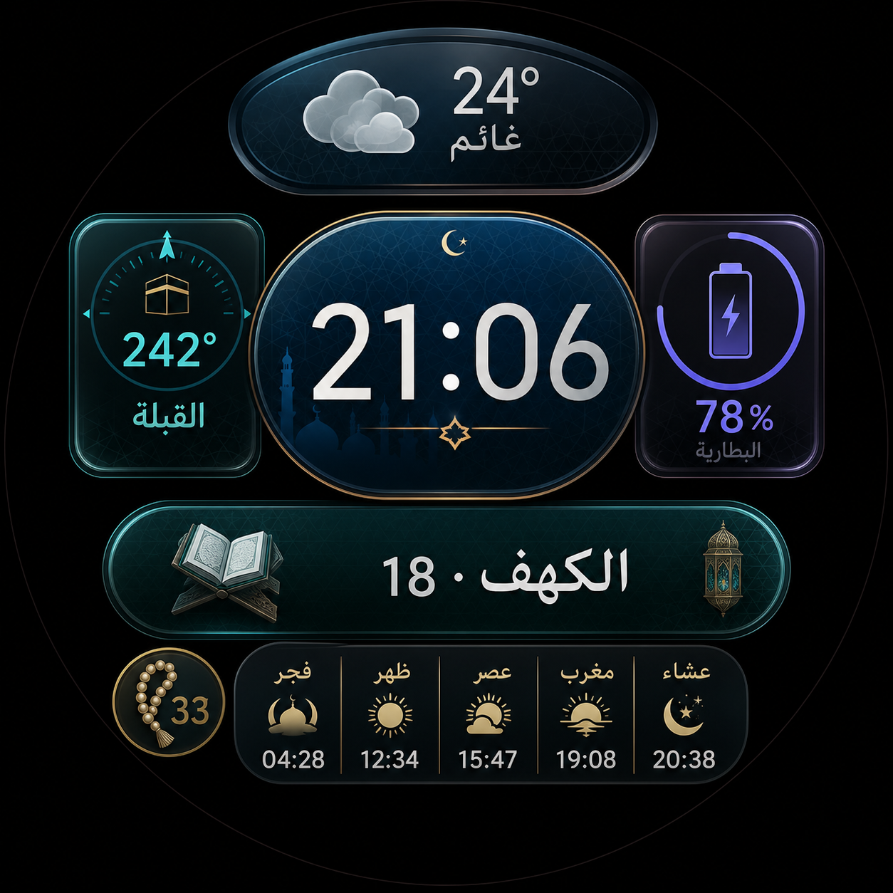

# ست واجهات إضافية مقترحة لرِواق

## ما تمت مراجعته

بُنيت المقترحات بعد مراجعة الواجهات التسعة في `WatchFaceModelId` وطريقة عرضها في
`WatchFaceHomeScreen.kt`، مع الالتزام بأنواع المعلومات الموجودة حاليًا في
`ComplicationType`. الواجهات الحالية التي تمت مراجعتها هي:

1. الرقمي الكلاسيكي.
2. الكرونوغراف التراثي.
3. الفلكي المحيطي.
4. الرقمي مع تنبيه الصلاة.
5. الكرونوغراف مع التنبيه.
6. الفلكي النقي.
7. الخط الممتد.
8. المداري القرآني.
9. الأفق الشمسي.

## قاعدة الجهاز الفعلية

الإطار الدوار للساعة يحتوي أصلًا أرقامًا وتدريجات؛ لذلك تنطبق القواعد التالية على
كل واجهة جديدة:

- هامش دائري فارغ لا يقل عن 12% من مساحة الشاشة.
- لا أرقام ساعات حول محيط الشاشة.
- لا درجات بوصلة ولا حروف اتجاهات ولا علامات تدريج على المحيط.
- يمكن استعمال قوس تقدم قصير داخل الشاشة، بشرط ألا يبدو كإطار أو تدريج ثانٍ.
- لا يلامس أي نص أو عنصر الحافة الداخلية للإطار الحقيقي.

تبقى الواجهات التسع السابقة كما هي؛ قاعدة منع الأرقام والتدريجات المحيطية تخص
الواجهات الست الجديدة فقط.

الكود المساعد موجود في:

- `WatchFaceProposalCatalog.kt`: المعرفات، فتحات المعلومات، الألوان، ومسارات الصور.
- `watch-face-models.js`: تعريفات جاهزة لإضافتها إلى مصمم الويب.

---

## 1. محراب الفجر — `FAJR_MIHRAB`



الفكرة: الوقت داخل محراب بصري هادئ، يليه العد التنازلي للصلاة، ثم مواقيت الصلوات
الخمس، وفي الأسفل العودة إلى موضع القراءة.

### موجّه التنفيذ

```text
اعمل داخل مشروع /Users/mohamad/reloj-main ونفّذ واجهة ساعة جديدة باسم «محراب الفجر» ومعرّف FAJR_MIHRAB، مستلهمًا التكوين من الصورة design-proposals/watchfaces-v2/images/01-fajr-mihrab.png من دون تحويل الصورة إلى خلفية ثابتة. ابنِ الواجهة بعناصر Jetpack Compose حقيقية وقابلة للتفاعل.

أضف المعرف إلى WatchFaceModelId، وفرعًا جديدًا في WatchFaceHomeScreen يستدعي FajrMihrabFaceView، واسمًا وصورة مصغرة في عارض الواجهات، وتعريفًا موازيًا في WATCH_FACE_MODELS داخل pwa-web/app.js. اجعل الوقت العنصر الأكبر داخل شكل محراب بسيط، والتاريخ الهجري أعلى الداخل، والصلاة القادمة والعد التنازلي أسفل الوقت، ومواقيت فجر/ظهر/عصر/مغرب/عشاء في صف واضح، وموضع القرآن في الأسفل. استخدم البيانات الحقيقية الموجودة في MainViewModel وPrayerTimesHelper وlastReadingPosition، ولا تضف مصدر بيانات جديدًا.

حافظ على النقر على فتحات المعلومات للتبديل، والضغط المطول للتخصيص، وفتح جدول الصلاة من معلومة الصلاة، وفتح موضع القراءة من القرآن. لأن الجهاز يملك إطارًا دوارًا مرقّمًا، اترك هامشًا دائريًا فارغًا 12% ولا ترسم أرقام ساعات أو درجات أو حروف اتجاه أو علامات محيطية. اكتب اختبارات العقد أولًا، ثم شغّل اختبارات Node وGradle assembleDebug وlintDebug. لا تدفع أو تنشر التغييرات.
```

---

## 2. نبض الذكر — `DHIKR_PULSE`



الفكرة: حلقة تسبيح داخلية هي مركز الواجهة، مع الوقت والصلاة وموضع القرآن والبطارية
والطقس الحقيقي.

### موجّه التنفيذ

```text
اعمل داخل /Users/mohamad/reloj-main ونفّذ واجهة «نبض الذكر» بمعرّف DHIKR_PULSE اعتمادًا على design-proposals/watchfaces-v2/images/02-dhikr-pulse.png كمرجع بصري فقط. يجب أن تكون الواجهة Compose حقيقية وليست صورة خلفية.

أضف DhikrPulseFace إلى WatchFaceHomeScreen واربطه بـ WatchFaceModelId وبالمصمم الويب. اعرض الوقت مركزيًا، وحلقة تسبيح داخلية ناعمة، واسم الذكر والعدد الحالي، والصلاة القادمة أعلى الداخل، والبطارية والطقس الحقيقي في شارتين صغيرتين، وموضع القرآن في كبسولة سفلية. استخدم TASBIH وBATTERY وWEATHER وNEXT_PRAYER وQURAN_RESUME. الضغط على منطقة التسبيح يزيد العدد المحفوظ مع اهتزاز خفيف، والضغط المطول يفتح نافذة السبحة المشتركة.

التزم بهامش داخلي 12% بسبب الإطار الدوار المرقّم؛ الحلقة داخلية وليست ملاصقة للحافة، ولا أرقام أو تدريجات ساعة حول المحيط. حافظ على تبديل وتخصيص فتحات المعلومات. ابدأ باختبارات فاشلة ثم نفّذ، وشغّل اختبارات الويب وassembleDebug وlintDebug. لا تضف خدمات أو صلاحيات أو بيانات جديدة ولا تنشر التغييرات.
```

---

## 3. بوصلة السكينة — `QIBLA_SERENITY`



الفكرة: سهم القبلة هو المؤشر الوحيد، من دون حلقة درجات أو اتجاهات تكرر أرقام الإطار.

### موجّه التنفيذ

```text
اعمل داخل /Users/mohamad/reloj-main ونفّذ واجهة «بوصلة السكينة» بمعرّف QIBLA_SERENITY مستلهمًا الصورة design-proposals/watchfaces-v2/images/03-qibla-serenity.png. ابنها بـ Jetpack Compose وبحساس الاتجاه والحساب الموجودين في QiblaCompassScreen، ولا تستنسخ حساب القبلة في أكثر من مكان؛ استخرج منطق bearing/heading إلى مكوّن أو دالة مشتركة قابلة للاختبار.

اجعل سهم القبلة والنجمة الثمانية في المركز، والوقت في الأعلى، والطقس والبطارية داخل بطاقتين صغيرتين، والصلاة القادمة في كبسولة سفلية، والشروق والغروب أسفلها. أضف المعرف والفرع والمصغّر وتعريف الويب، وحافظ على فتح شاشة البوصلة الكاملة عند النقر على المركز وعلى تخصيص فتحات WEATHER وBATTERY وNEXT_PRAYER.

هذه الواجهة ممنوع فيها منعًا صريحًا رسم درجات 0–360 أو N/E/S/W أو أي علامات محيطية، لأن الإطار الدوار الحقيقي للساعة مرقّم. اترك هامشًا أسود 12% حول المحتوى، واجعل السهم المركزي وحده مؤشر الاتجاه. اكتب اختبارات للحساب ولعقد عدم وجود perimeter degree labels، ثم شغّل اختبارات Node وGradle assembleDebug وlintDebug. لا تنشر التغييرات.
```

---

## 4. رِواق الآية — `QURAN_GALLERY`



الفكرة: واجهة قراءة؛ يبدأ السطر باسم السورة ورقم الآية ثم يأتي المتن مباشرة ويلتف
طبيعيًا، مع وقت صغير وتنبيه الصلاة.

### موجّه التنفيذ

```text
اعمل داخل /Users/mohamad/reloj-main ونفّذ واجهة «رِواق الآية» بمعرّف QURAN_GALLERY مستلهمًا design-proposals/watchfaces-v2/images/04-quran-gallery.png، من دون استعمال الصورة نفسها داخل التطبيق.

أضف QuranGalleryFaceView وربطه بالمعرف الجديد وبعارض الواجهات ومصمم الويب. اجعل الوقت والتاريخ الهجري في أعلى الداخل بحجم ثانوي، ثم بطاقة قراءة كبيرة تستخدم buildAnnotatedString: اسم السورة ورقم الآية بلون ذهبي، ثم مسافة واحدة، ثم ayahSnippet على السطر نفسه مع التفاف طبيعي إلى سطر ثانٍ أو ثالث. لا تضع اسم السورة في سطر مستقل. أضف موعد الصلاة التالي وزر العلامة في الأسفل. النقر على النص يفتح موضع القراءة، والنقر على العلامة ينفذ وظيفة العلامات الحالية، والضغط المطول يحافظ على تخصيص الواجهة.

استخدم فقط lastReadingPosition والإعدادات الحالية للخط واللون والحجم، وقدّم حالة بديلة سليمة عند عدم وجود موضع محفوظ. اترك هامش 12% بلا أرقام أو تدريجات محيطية بسبب الإطار الحقيقي. اكتب اختبارات النص والالتفاف والمسارات أولًا، ثم شغّل اختبارات Node وassembleDebug وlintDebug. لا تنشر التغييرات.
```

---

## 5. مدارات اليوم — `DAILY_ORBITS`



الفكرة: أقواس داخلية قصيرة للبطارية والفترة بين الصلوات وضوء النهار والتسبيح، من دون
أي تدريج على الحافة.

### موجّه التنفيذ

```text
اعمل داخل /Users/mohamad/reloj-main ونفّذ واجهة «مدارات اليوم» بمعرّف DAILY_ORBITS مستلهمًا design-proposals/watchfaces-v2/images/05-daily-orbits.png. المطلوب Compose حقيقي مع Canvas للأقواس، لا صورة خلفية.

اعرض الوقت والتاريخ في كبسولة مركزية، وأربعة أقواس قصيرة منفصلة داخل الشاشة: البطارية، نسبة الزمن المنقضي بين الصلاة السابقة والقادمة، نسبة ضوء النهار المحسوبة من الشروق إلى الغروب، وتقدم التسبيح. اعرض القيم داخل مناطقها ولا تضع الأرقام على القوس نفسه. أظهر الصلاة القادمة في الأسفل، ولا تستخدم بيانات خطوات أو نبض وهمية.

ضع الأقواس داخل هامش 12% وبأطوال قصيرة كي لا تبدو كإطار ثانٍ، وامنع أرقام الساعات ودرجات البوصلة والحروف والعلامات المحيطية. استخرج حساب نسبة الفترة بين الصلاتين إلى دالة نقية واختبرها، ثم شغّل اختبارات Node وassembleDebug وlintDebug. لا تنشر التغييرات.
```

---

## 6. فسيفساء المؤمن — `BELIEVER_MOSAIC`



الفكرة: توزيع متعدد الأشكال من بلاطات بيضوية ومربعة زجاجية، يستفيد من نظام
`mixed` الموجود في المشروع.

### موجّه التنفيذ

```text
اعمل داخل /Users/mohamad/reloj-main ونفّذ واجهة «فسيفساء المؤمن» بمعرّف BELIEVER_MOSAIC بالاستناد إلى design-proposals/watchfaces-v2/images/06-believer-mosaic.png كمرجع تصميم فقط. استخدم مكونات Compose والبلاطات الحالية ولا تعرض الصورة داخل الساعة.

أنشئ BelieverMosaicFaceView بتوزيع داخلي متوازن: الطقس في بلاطة بيضوية علوية، القبلة يسارًا، البطارية يمينًا، الوقت في بلاطة مركزية كبيرة، موضع القرآن في بلاطة أفقية، جدول الصلوات الخمس في صفين، وشارة تسبيح صغيرة. أعد استخدام PrayerStripTable أو استخرج نسخة مشتركة منه بدل تكراره. استخدم QIBLA وBATTERY وWEATHER وQURAN_RESUME وNEXT_PRAYER وTASBIH فقط. كل بلاطة قابلة للنقر إلى وظيفتها، والضغط المطول يفتح تخصيصها.

احترم الشاشة الدائرية والإطار الدوار: هامش فارغ 12%، ولا أرقام أو علامات على المحيط، ولا عنصر يلامس الحافة. طبّق تدرج زجاجي خفيف من دون مؤثرات مكلفة دائمًا على البطارية، وراعِ Ambient Mode. أضف المعرف والفرع والمصغّر وتعريف الويب، واكتب الاختبارات أولًا، ثم شغّل اختبارات Node وassembleDebug وlintDebug. لا تنشر التغييرات.
```

## ترتيب التنفيذ المقترح

1. رِواق الآية.
2. بوصلة السكينة.
3. محراب الفجر.
4. نبض الذكر.
5. فسيفساء المؤمن.
6. مدارات اليوم.

الترتيب يبدأ بالأكثر اختلافًا وفائدة عن الواجهات التسعة الحالية، ويؤجل الواجهات
الأكثر كثافة أو التي تحتاج حسابات إضافية إلى النهاية.
